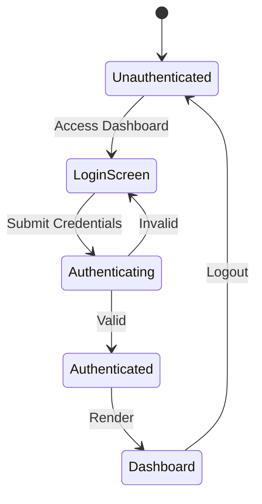
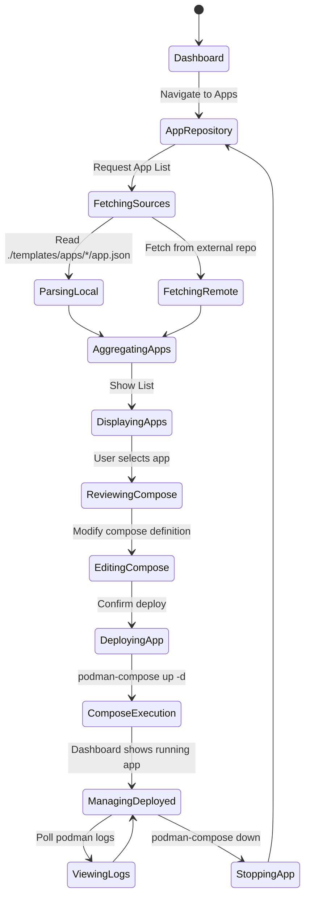
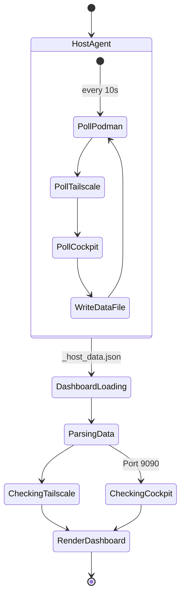

## Software Requirements Specification (SRS) for Nasypeasy

### 1. Introduction
#### 1.1 Purpose
This document specifies the software requirements for Nasypeasy, a lightweight, self-hosted operating system dashboard tailored for hobbyists. It outlines the features, architecture, and interaction flows required to deliver a simple yet powerful management interface.

#### 1.2 Scope
Nasypeasy is a Flask-based web application providing:
- Secure user authentication using DuckDB.
- Container management backed by Podman.
- Network visibility via Tailscale integration.
- Dynamic app deployment via a repository-backed system (local app folders with compose specs, remote JSON manifests).
- Conditional dashboard integration for Cockpit (port 9090).

### 2. Overall Description
#### 2.1 User Characteristics
The target users are hobbyist self-hosters who need a minimalistic, single-pane-of-glass dashboard to manage their home servers without the bloat of enterprise solutions.

#### 2.2 System Environment
- **Backend:** Python, Flask, DuckDB
- **Frontend:** HTML/Tailwind CSS (Mono design system)
- **Container Engine:** Podman
- **Networking:** Tailscale
- **Package Management:** Pixi

### 3. System Features
#### 3.1 User Authentication
Secure login, registration, and session management.

#### 3.2 Dashboard Overview
Displays server status, Tailscale IP/status, and a link to Cockpit if available on port 9090.

#### 3.3 Container Management
List, start, and stop Podman containers.

#### 3.4 App Repository System
Discover and deploy apps from a local directory (`./templates/apps`) or an external repository URL. App definitions use a folder structure with metadata and compose files. A Monaco-based editor allows inspecting and modifying the compose definition before deployment.

### 4. State Diagrams

#### 4.1 Authentication Flow

#### 4.2 App Discovery and Deployment Flow

#### 4.3 External Services Integration (Tailscale & Cockpit)

